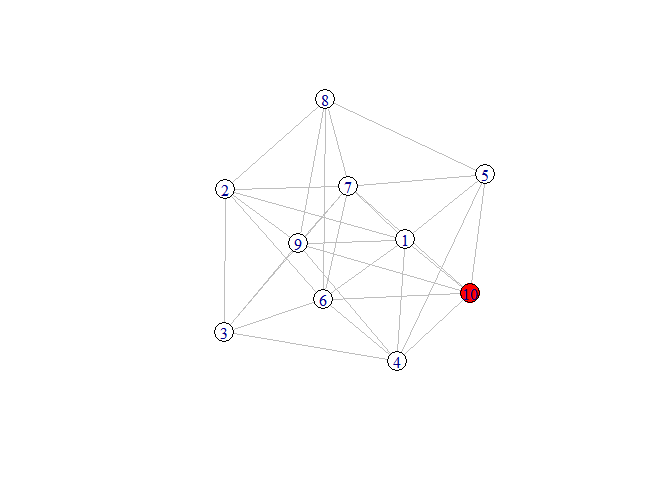

<!-- README.md is generated from README.Rmd. Please edit that file -->

# SIRInNetwork

<!-- badges: start -->

<!-- badges: end -->

It just provide functions to simulate the SIR epidemic dynamics model on
the network structures. You can generate a network structure GIF graph
with a line subgraph and a bar subgraph by seting some basic parameters.
The line subgraph describes the total number of nodes in the infected
state at different times. The bar subgraph describes the growth of
number of infected nodes in current time and last time in different
times.

## Installation

You can install the released version of SIRInNetwork from
[CRAN](https://CRAN.R-project.org) with:

``` r
install.packages("SIRInNetwork")
```

And the development version from [GitHub](https://github.com/) with:

``` r
# install.packages("devtools")
devtools::install_github("AllToBeNice/SIR_In_Network")
```

## Example

This is a basic example which shows you how to solve a common problem:

``` r
library(SIRInNetwork)
Var_Param <- set_param("Random Network", c(0.7), N = 10, TIME = 70, I = 1, R = 0, InfectedRate = 0.12, RemovedRate = 0.4, Latency_Infected = 7)
simulate(Var_Param)
#> Output at: animation.gif
#> [1] TRUE
## basic example code
```


